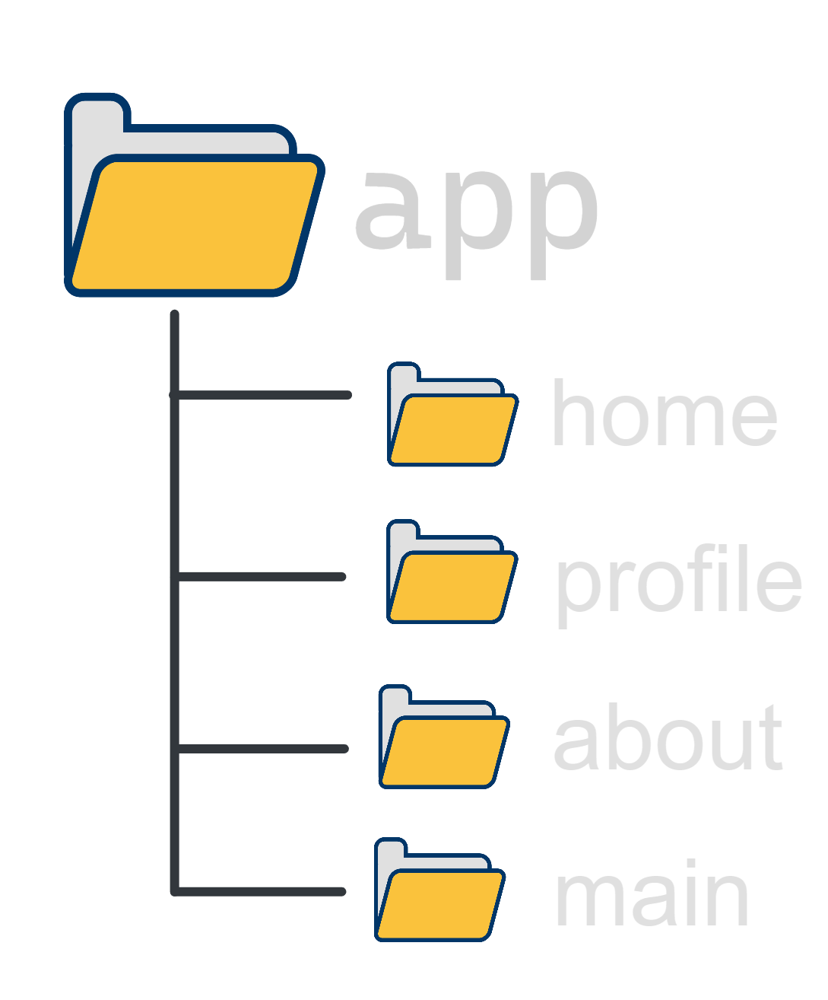

# NextJs Tutorial for Beginners

## 🔗 Next.js Routing System

- Each folder in the `app` directory becomes a route and the folder name becomes the routes' path.

- For example, if you have a folder called `pages/about`, then you will have a route called `/about`.

