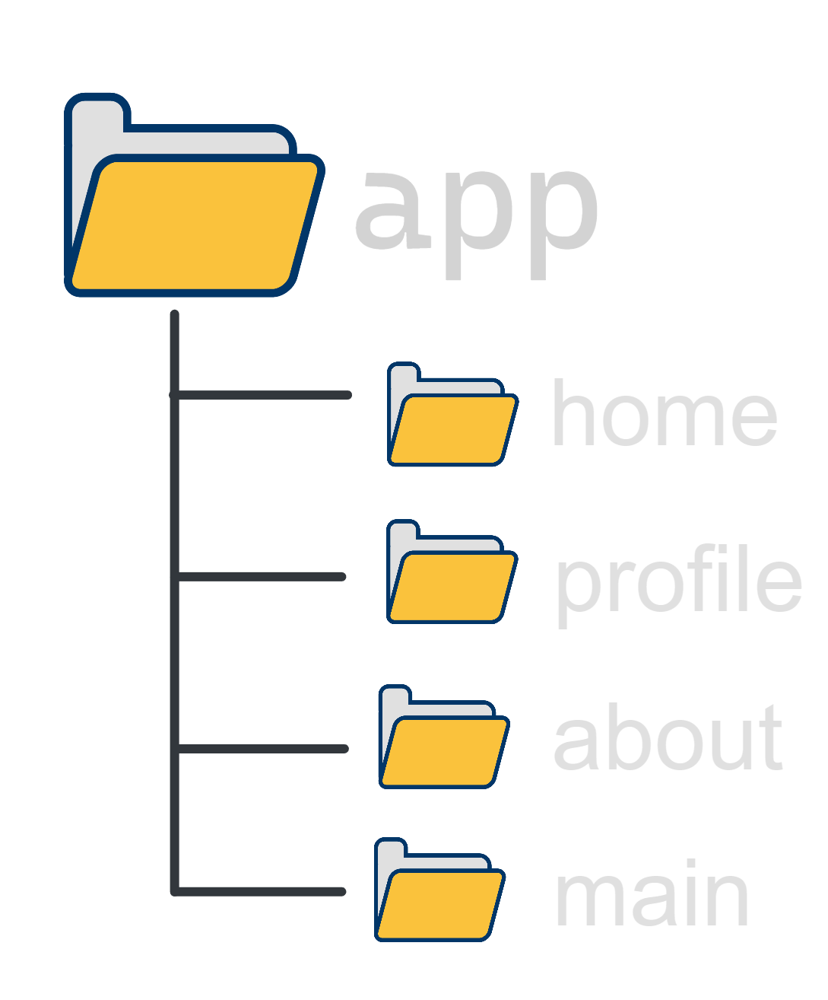
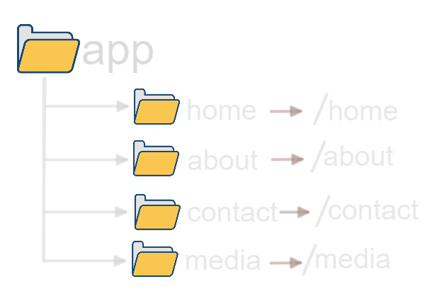

# NextJs Tutorial for Beginners

## 🔗 Next.js Routing System

- Each folder in the `app` directory becomes a route 

- The folder name becomes the routes' path.

- For example if we want to create a route for the `about` page, we create a folder called `about` inside the `app` directory.
you can access the `about` page by going to `localhost:3000/about`
